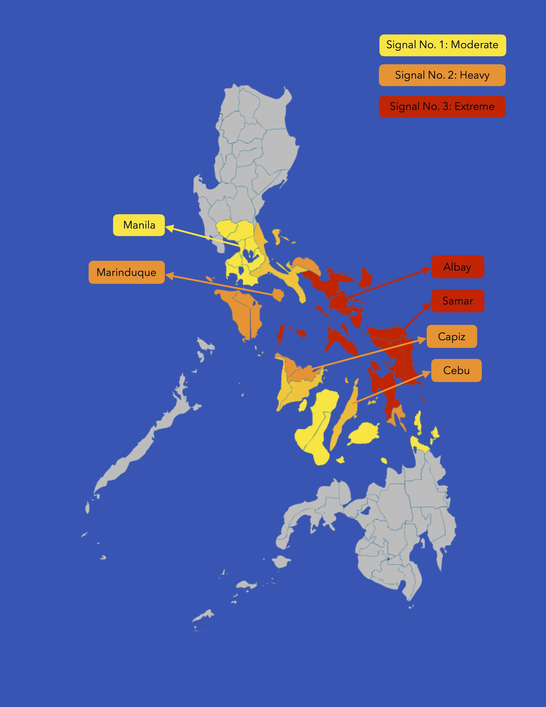

```{r, warning=FALSE,  echo = FALSE, include = FALSE}
library(lubridate)
library("tm")
library("SnowballC")
library("wordcloud")
library("RColorBrewer")
```
#### Lorenzo Flores

## About the Analysis

#### Background 

Typhoon Ruby (2014) is amongst the most devastating tropical storms to have impacted the Philippines in recent years. Classified as a 5 (out of 5) on the Saffir–Simpson Typhoon scale, it killed 18 and injured 916 individuals, and cost $114USD in property damage (NDRRMC, 2014). Damage caused by typhoons could be mitigated by prompt evacuation and ample preparation. Unfortunately, media literacy and dissemination of information remain long-standing problems in the Philippines. \n

Facebook remains a popular source of information for many Filipinos, with sites including the Philippine Atmospheric, Geophysical and Astronomical Services Administration (PAGASA) that send updates on weather and typhoons (Camus, 2018). In order to understand problems and identify potential solutions with regards to how PAGASA disseminates typhoon information, this analysis aims to (1) understand people's sentiments towards PAGASA updates on Typhoon Ruby, and (2) identify what kind of information Filipinos hope to gain from these posts.

#### Results

The analysis showed that Filipinos had difficulty understanding weather reports and visualizing the typhoon's path. People commented asking for basic information such as where the typhoon would hit, how hard it would rain, and what the typhoon warnings meant. People also found it difficult to interpret the colors and graphs, and some requested that the posts be written in Filipino. Finally, multiple comments asked about the differences between the reports made by PAGASA and JMA (Japan Meteorological Agency). 

It was found that the number of comments dropped during the onset of the storm, which could be attributed to the loss of internet signal as the typhoon destroyed telecommunication lines. Thus, Facebook could be unreliable for disseminating information during a typhoon. 

#### Action

To address these issues, PAGASA could:

* Promote media literacy by releasing infographics on understanding typhoon maps and videos showing samples of what each typhoon warning (moderate, heavy, extreme) looks like. 
* List the affected cities, the time of arrival and departure of the typhoon, and the associated signal in Filipino. 
* Clarify reports with the JMA (Japan Meteorological Agency) to avoid confusion.
* Consider other platforms for disseminating information other than Facebook.

\newpage

## Data Cleaning

The data sets used for this analysis came from the comments on Facebook posts of PAGASA while tracking the path of Typhoon Ruby in December 2014. The data was obtained from Excel spreadsheets that categorized the comments from an internship performed under Dr. Gerry Bagtasa of the Institute of Environmental and Meteorological Science at the University of the Philippines. 

Source: https://drive.google.com/drive/folders/1pJaVdhMjBhdbR5sI-tvgzVBvpbdjYtT_?usp=sharing \n

Each data set came from the comments for one post by PAGASA tracking Typhoon Ruby's path. The data cleaning involved removing spaces and numbers from comments, parsing the date and time into R formats, and merging comments for the data sets into one.
```{r, warning=FALSE,  echo = FALSE, include = FALSE}
for(i in 1:22){
  name <- paste0("RUBY", i)
  read <- paste0("Ruby Comments ", i, " - Sheet1.csv")
  assign(name,read.csv(read, header=FALSE, as.is=TRUE))
}
```

```{r, include = FALSE, warning=FALSE,  echo = FALSE}
removeInitialSpaces <- function(dataFrame){
  for(i in 1:nrow(dataFrame)){
    if(substr(dataFrame[i,25], 1, 1) == " "){
      dataFrame[i,25] <- substr(dataFrame[i,25], 2, nchar(dataFrame[i,25]))
    }
  }
  return(dataFrame)
}
```

```{r, include = FALSE, warning=FALSE,  echo = FALSE}
cleanDateTime <- function(dataFrame){
  dateTimes <- dataFrame[,25]

  vecDates <- rep(NA, nrow(dataFrame))
  vecTimes <- rep(NA, nrow(dataFrame))
  
  for(i in 1:nrow(dataFrame)){
    positionComma <- as.numeric(gregexpr(',', dateTimes[i])[[1]][1]) 
    positionSpace1 <- as.numeric(gregexpr(' ', dateTimes[i])[[1]][1])
    positionSpace2 <- as.numeric(gregexpr(' ', dateTimes[i])[[1]][4])
 
    vecDates[i] <- as.Date(substr(dateTimes[i], 1, positionComma + 5), format = '%B %d, %Y')
 
    if(substr(dateTimes[i], nchar(dateTimes[i])-1, nchar(dateTimes[i])) == "am"){
      vecTimes[i] <- as.character(hm(substr(dateTimes[i], positionSpace2+1, positionSpace2+4)))
    }
    else{
      vecTimes[i] <- as.character(hm(substr(dateTimes[i], positionSpace2+1, nchar(dateTimes[i])-2)) + hm("12:00"))
    }
  }

  dataFrame$date <- vecDates
  dataFrame$time <- vecTimes
  return(dataFrame)
}
```

```{r, warning=FALSE,  echo = FALSE,  include = FALSE}
clean <- function(dataFrame){
  colnames(dataFrame) <- dataFrame[1,]
  colnames(dataFrame)[1] <- "Comments"
  dataFrame <- dataFrame[-1,] 
  dataFrame[,2:24] <- sapply(dataFrame[,2:24], as.numeric)
  dataFrame[,c(2:24, 26:28)] <- sapply(dataFrame[,c(2:24, 26:28)], as.numeric)
  dataFrame <- dataFrame[which(dataFrame[,25]!=""),]
  dataFrame <- dataFrame[which(dataFrame[,1]!=""),]
  dataFrame <- removeInitialSpaces(dataFrame)
  dataFrame <- cleanDateTime(dataFrame)
  dataFrame[,1] <- gsub("\n", "", dataFrame[,1])
  dataFrame[,1] <- gsub("December.*", "", dataFrame[,1])
  return(dataFrame)
}
```

```{r, include = FALSE, warning=FALSE,  echo = FALSE}
RUBY1 <- clean(RUBY1)
RUBY2 <- clean(RUBY2)
RUBY3 <- clean(RUBY3) 
RUBY4 <- clean(RUBY4) 
RUBY5 <- clean(RUBY5) 
RUBY6 <- clean(RUBY6) 
RUBY7 <- clean(RUBY7) 
RUBY8 <- clean(RUBY8)
RUBY9 <- clean(RUBY9)
RUBY10 <- clean(RUBY10)
RUBY11 <- clean(RUBY11)
RUBY12 <- clean(RUBY12) 
RUBY13 <- clean(RUBY13) 
RUBY14 <- clean(RUBY14) 
RUBY15 <- clean(RUBY15) 
RUBY16 <- clean(RUBY16) 
RUBY17 <- clean(RUBY17) 
RUBY18 <- clean(RUBY18) 
RUBY19 <- clean(RUBY19) 
RUBY20 <- clean(RUBY20) 
RUBY21 <- clean(RUBY21) 
RUBY22 <- clean(RUBY22)
RUBYmain <- do.call("rbind", list(RUBY1, RUBY2, RUBY3, RUBY4, RUBY5, RUBY6, RUBY7, RUBY8, RUBY9, RUBY10, RUBY11, RUBY12, RUBY13, RUBY14, RUBY15, RUBY16, RUBY17, RUBY18, RUBY19, RUBY20, RUBY21, RUBY22))
```

```{r, include = FALSE, warning=FALSE,  echo = FALSE}
#Function for Word Frequency
wordFreq <- function(x){
docs <- Corpus(VectorSource(x))
inspect(docs)
toSpace <- content_transformer(function (x , pattern ) gsub(pattern, " ", x))
docs <- tm_map(docs, toSpace, "/")
docs <- tm_map(docs, toSpace, "@")
docs <- tm_map(docs, toSpace, "\\|")
docs <- tm_map(docs, content_transformer(tolower))
docs <- tm_map(docs, removeNumbers)
docs <- tm_map(docs, removeWords, stopwords("english"))
docs <- tm_map(docs, removePunctuation)
docs <- tm_map(docs, stripWhitespace)
dtm <- TermDocumentMatrix(docs)
m <- as.matrix(dtm)
v <- sort(rowSums(m),decreasing=TRUE)
d <- data.frame(word = names(v),freq=v)
head(d, 50)
}
```
\newpage

## Data Analysis

The data sets already classified the comments under the following categories as shown below. Comments could be classified under multiple tags.

* `Expressing Emotion:` Happy, Thankful, Hopeful, Sad, Angry, Scared
* `About Religion:` Thanking God, Fearing Punishment from God, Asking People to Pray, Being Angry at God, Against Religion
* `Information:` Giving Information, Asking for Information
* `Views towards PAGASA and Government:` Thanking PAGASA, Thanking the Government, Angry at PAGASA, Angry at the Government
* `Concern for Others:` Concern for Family/Relatives, Concern for Filipinos, Safety Issues
* `Views on Science/Technology:` Appreciative of Weather Science/Technology, Doubtful of Weather Science/Technology

Other variables include

* `Name:` Facebook user's name
* `Likes:` Number of likes for the comment
* `Tagging:` If the comment tagged another  person (1 if yes, NA if no)
* `Against Other's Comments:` If the comment was a negative response to another person's comment (1 if yes, NA if no)
* `Date:` Date of comment
* `Time:` Time when commented

### Facebook Post Analysis

#### Figure 1. Comments by Date
```{r, warning=FALSE,  fig.height=4, fig.width=7, echo = FALSE}
barplot(table(as.Date(RUBYmain$date, origin ="1970-01-01")), las = 2, main = "Number of Comments by Date", ylab = "Number of Comments")
```

Most comments were posted on December 4 through 6, with a sudden decrease in comments from December 7 onwards. Typhoon Ruby made landfall on December 6 and moved through the Philippines until December 8 (de Lara, 2014). The drop in comments could be attributed to the loss of internet signal as the typhoon destroyed telecommunication lines. This also indicates that Facebook and online platforms may be unreliable for disseminating information during a typhoon.

### Analyzing Sentiments by Tags
```{r, include = FALSE, warning=FALSE,  echo = FALSE}
allCategories <- list()
for(i in 1:nrow(RUBYmain)){
  x <- which(RUBYmain[i, c(2:23)]>=1)
  n <- colnames(RUBYmain)[x]
  allCategories[[i]] <- n
}
```
#### Figure 2. Top Individual Tags
```{r, warning=FALSE,  fig.height=3, fig.width=6, echo = FALSE}
par(mar=c(4,9,2,5))
barplot(tail(sort(table(unlist(allCategories)))), horiz = TRUE, las = 1, main = "Top Individual Tags", xlab = "Number of Comments")
```

The most frequent comments expressed anger towards God and anti-religion sentiments, which is surprising given that the Philippines is about 94% Christian (Miller, n.d.). It is also interesting that religion is the first thing to come to mind on most comments, as compared to expressions of emotions or concern for others. Most Filipinos also expressed fear with regards to the typhoon as expected, and a considerable fraction of comments appear to ask and give information, which will be further analyzed in the following sections. \n 

Some comments were filed under multiple tags. These comments were analyzed to see if there were patterns in tags that appeared together.
```{r, include = FALSE, warning=FALSE,  echo = FALSE, message = FALSE}
numCategory <- rep(NA, nrow(RUBYmain))
for(i in 1:nrow(RUBYmain)){
  numCategory[i] <- sum(RUBYmain[i,c(2:23)], na.rm = TRUE)
}
table(numCategory)
```

```{r, include = FALSE, warning=FALSE,  echo = FALSE}
multipleIndex <- which(numCategory>1)
multipleCategories <- list()
for(i in 1:length(multipleIndex)){
  x <- which(RUBYmain[multipleIndex[i], c(2:23)]>=1)
  multipleCategories[[i]] <- c(paste(sort(colnames(RUBYmain)[x]), collapse = ', '), sort(colnames(RUBYmain)[x]), RUBYmain[multipleIndex[i], 26:27])
  }
```
#### Table 1. Top Tags Appearing Together in Comments With Multiple Tags
```{r, warning=FALSE,  fig.height=4, fig.width=5, echo = FALSE}
par(mar=c(4,9,2,5))
tail(sort(table(unlist(lapply(multipleCategories, `[[`, 1)))), 8)
```

Like in Figure 1, the "Angry at God" sentiment appeared consistently, even when asking PAGASA for information or expressing concern for other Filipinos. This reflects the large role religion plays in modern Filipino mentality, and how typhoons are viewed by the Philippine public as a manifestation of God's actions rather than a scientific phenomenon.\n 

```{r, include = FALSE, warning=FALSE,  echo = FALSE}
classCateg <- function(x){
  r <- NA
  if(x %in% c("Happy", "Thankful", "Hopeful", "Sad", "Angry", "Scared")){
    r <- "Emotions"
  }
  if(x %in% c("Thanks/Praise God", "Angry at God", "Let's Pray/Amen", "Against Religion")){
    r <- "Religion"
  }  
  if(x %in% c("Giving Info", "Asking for Info")){
    r <- "Information"
  }
  if(x %in% c("Thanks PAGASA", "BOO Pagasa", "WOO Gov Efforts", "BOO Gov Efforts")){
    r <- "PAGASA and Government"
  }
  if(x %in% c("Family/Relatives", "Filipinos", "Safety")){
    r <- "Concern for Others"
  }
  if(x %in% c("Approving Science", "Against Science")){
    r <- "Understanding of Science"
  }
  return(r)
}
```


```{r, include = FALSE, warning=FALSE,  echo = FALSE}
RUBYmain$`Against Other's Comments`[is.na(RUBYmain$`Against Other's Comments`)] <- 0 
LIKES <- data.frame(Category=c(1), Main=c(1), Likes=c(1), Against=c(1), Date=c(1))
for(i in which(numCategory==1)){
  x <- colnames(RUBYmain)[which(RUBYmain[i, c(2:23)]>=1)]
  r <- classCateg(x)
  v <- c(x, r, RUBYmain$Likes[i], RUBYmain$`Against Other's Comments`[i], RUBYmain$date[i])
  LIKES <- rbind(LIKES, v)
}

for(i in 1:length(multipleCategories)){
  l <- length(multipleCategories[[i]])
  for(x in 2:(l-2)){
    x <- as.character(multipleCategories[[i]][x])
    r <- classCateg(x)
    v <- c(x, r, as.numeric(multipleCategories[[i]][l-1]), RUBYmain$`Against Other's Comments`[multipleIndex[i]], RUBYmain$date[multipleIndex[i]])
    LIKES <- rbind(LIKES, v)
  }
}

LIKES$Category <- as.character(LIKES$Category)
LIKES$Likes <- as.numeric(LIKES$Likes)
LIKES$Against <- as.numeric(LIKES$Against)
LIKES$Date <- as.factor(LIKES$Date)
LIKES <- LIKES[-1,]
```

#### Figure 3. Classifying Comments by Emotion
```{r, warning=FALSE,  fig.width=6, fig.height=3, echo = FALSE}
par(mar=c(4,8,4,4))
barplot(sort(table(LIKES$Category[LIKES$Main == "Emotions"]), decreasing = FALSE), horiz = TRUE, las = 1, main = "Emotions", xlab = "Number of Comments")
```

Most people expressing emotions in the comments were scared of the typhoon. Interestingly however, a good number of people still expressed feelings of thankfulness despite the incoming storm. Most of these comments were towards other people for sharing information.

#### Figure 4. Comments by Main Tags
```{r, warning=FALSE,  fig.width=6, fig.height=3, echo = FALSE}
par(mar=c(4,13,4,4))
barplot(sort(table(LIKES$Main)), horiz = TRUE, las = 1, main = "Top Main Tags", xlab = "Number of Comments")
```

Similar to the previous tables, we see religion dominating the discussion on the Typhoon Ruby posts, with over 1500 comments regarding religion, as compared to 460 comments flagged discussing information on the typhoon, and merely 5 comments mentioning science. These are excerpts from the comments on science (Translated from Filipino):

* Prayers will not save us. Instead be vigilant, informative and educate. Only the correct information and preparation will save us.
* The question is, who is correct - Japan's JMA or America's JTWC? According to Magtani, they both use the latest technology.
* The information is accurate as of the moment it was released, but it (weather conditions) can change at any point. Our scientific technology is still limited as no weather station in the world is 100% accurate.

#### Table 2. Against Other's Comments Sentiments
```{r, include = FALSE}
sum(RUBYmain$`Against Other's Comments`[which(numCategory==0)])
sum(RUBYmain$`Against Other's Comments`[which(numCategory>0)])
```
```{r, echo = FALSE}
head(sort(table(LIKES$Category[LIKES$Against==1]), decreasing = TRUE), 4)
```

Amongst the comments that expressed disagreement with others, only 15 out of 145 actually expressed opinions, again angry at God or against religion. The other 130 comments were unclassified - consisting of trash-talk or insults towards others without introducing input. It is unfortunate that this is the kind of discourse that is carried out even when dealing with weather reports.

### Analyzing Sentiments by Likes
#### Figure 5. Likes by Main Category
```{r, warning=FALSE,  fig.width=8, fig.height=8, echo = FALSE}
par(mar=c(4,13,4,4))
par(mfrow=c(2,1))
boxplot(Likes~Main, data = LIKES, horizontal = TRUE, las = 1, pch = 16, cex = 0.5, col = rgb(0,0,0,0.6), main = "Likes per Post by Main Category", xlab = "Likes")
boxplot(Likes~Main, data = LIKES, ylim=c(0,20), horizontal = TRUE, las = 1, pch = 16, cex = 0.5, col = rgb(0,0,0,0.6), main = "Likes per Post by Main Category (Close-up)", xlab = "Likes")
```

The barplots show that a comment garnered 1 like on average, with the exception of religion with 2 likes on average. The religion and emotions category however had multiple outliers, with some comments gaining over 100 likes. These agree with previous information showing that many Filipinos agree with others' sentiments mostly on religion and emotions.

### Problem Analysis

#### People's Thoughts on PAGASA and Government
```{r}
table(LIKES$Category[LIKES$Main == "PAGASA and Government"])
```
```{r, include = FALSE}
sum(LIKES$Category == "BOO Pagasa", na.rm = TRUE)/sum(LIKES$Category == "BOO Pagasa" | LIKES$Category == "Thanks PAGASA", na.rm = TRUE)
```
Nearly 80% of comments about PAGASA expressed dissatisfaction with the weather agency. Word frequency amongst these comments were analyzed as follows.

```{r, echo = FALSE, message = FALSE, warning = FALSE, include = FALSE}
antiPagasaComments <- RUBYmain$Comments[which(RUBYmain$`BOO Pagasa`==1)]
wordFreq(antiPagasaComments)
```

The words "color", "track", "mali" (wrong), "tama" (correct), "pagasa", "please", "mark", "legend", "wrong", "DOST" (Dept. of Science and Technology) were then searched in the comments.

```{r, message = FALSE, include = FALSE}
antiPagasaKeywords <- c("color", "track", "mali", "tama", "pagasa", "please", "mark", "legend", "wrong", "dost")
grep(paste(antiPagasaKeywords,collapse="|"), antiPagasaComments, perl = TRUE, value = TRUE, ignore.case=TRUE)
```

People mostly appear to be complaining about PAGASA releasing an incorrect post of the typhoon's track, as well as incorrect color legends and broken animations. Another person pointed out that it would be better if posts were in Filipino for others to understand reports better.

#### Information People are Seeking

Word frequency amongst the "Asking for Info" comments was counted. Amongst the top words were Manila, Marinduque, Samar, Albay, Capiz, and Cebu - different areas in the Philippines which were affected by the storm. Comments containing each area were viewed together and summarized below. 

```{r, warning=FALSE,  echo = FALSE, message = FALSE, include = FALSE}
infoComments <- RUBYmain$Comments[which(RUBYmain$`Asking for Info`==1)]
wordFreq(infoComments)
```

##### Info by Area



\n

###### Manila
* Location: Northern Philippines
* Strength of Typhoon: Signal 1 (Moderate)
* Comments: People are unsure whether the typhoon will hit Manila and why it is only rated signal 1 (moderate). A few comments also asked about flight status.

###### Marinduque
* Location: Central Philippines
* Strength of Typhoon: Signal 2 (Strong)
* Comments: People asking why there is no typhoon report for Marinduque, and whether or not the typhoon warnings have been lifted for the area.

###### Albay
* Location: Eastern Philippines
* Strength of Typhoon: Signal 3 (Severe)
* Comments: People asking for how strong the typhoon will be and when the typhoon will leave.

###### Samar
* Location: Eastern Philippines
* Strength of Typhoon: Signal 3 (Severe)
* Comments: People asking why PAGASA and Japan's weather forecasts are inconsistent, with PAGASA saying the typhoon will make landfall in Samar and Japan marking it elsewhere. People also commented asking PAGASA to clarify the path of the typhoon and whether or not Samar would be affected.

###### Capiz
* Location: Western Philippines
* Strength of Typhoon: Signal 2 (Heavy)
* Comments: People asked when Capiz would be hit and how strong the rain would be.

###### Cebu
* Location: Central Philippines
* Strength of Typhoon: Signal 2 (Heavy)
* Comments: People asking when the rain in Cebu would stop.

```{r, warning=FALSE,  warning=FALSE, echo = FALSE, message=FALSE, include = FALSE}
grep(paste("marinduque",collapse="|"), infoComments, perl = TRUE, value = TRUE, ignore.case=TRUE)
grep(paste("manila",collapse="|"), infoComments, perl = TRUE, value = TRUE, ignore.case=TRUE)
grep(paste("samar",collapse="|"), infoComments, perl = TRUE, value = TRUE, ignore.case=TRUE)
grep(paste("capiz",collapse="|"), infoComments, perl = TRUE, value = TRUE, ignore.case=TRUE)
grep(paste("albay",collapse="|"), infoComments, perl = TRUE, value = TRUE, ignore.case=TRUE)
grep(paste("cebu",collapse="|"), infoComments, perl = TRUE, value = TRUE, ignore.case=TRUE)

infoComments <- infoComments[-grep(paste(c("samar", "manila", "marinduque", "albay", "capiz", "cebu"),collapse="|"), infoComments, perl = TRUE, ignore.case=TRUE)]
```

##### Other Queries

The comments containing names of places (summarized above) were removed, then another search containing keywords pertaining to asking questions were pulled up. \n 

The following keywords were included: \n

* "bakit" - Why
* "wala" - None
* "may" - Is there
* "pls" - Please
* "ano", "anong", "anu" - What
* "bang" - Interjection pertaining to questions
* "hindi" - Not
* "kasi" - Because

\n

Common questions were:

* Why is the typhoon moving so slowly?\n
* Can PAGASA give hourly updates?\n
* Where exactly is typhoon Ruby going to pass?\n
* Is my city going to be affected? What's the typhoon signal?\n

```{r, echo = FALSE, message = FALSE, warning = FALSE, include = FALSE}
infoKeywordsQn <- c("bakit", "wala", "may", "pls", "ano", "bang", "hindi", "kasi", "anong", "anu")
grep(paste(infoKeywordsQn,collapse="|"), infoComments, perl = TRUE, value = TRUE, ignore.case=TRUE)
```

### Actions to Take

##### Promote media literacy when it comes to understanding weather forecasts and reports.

Among the comments, a number of them included questions such as:

* When will the rain stop? 
* How hard will it rain? 
* When is it going to hit? 
* Where will it hit? 
* Why is the typhoon signal in this area categorized this way? 

These are very basic questions that can be gleaned from weather reports, however people still do not seem to be able to obtain this information from the weather reports. PAGASA could release posters/infographics explaining what the components of a weather report mean, and how to interpret typhoon path maps. People would also benefit from pictures and videos showing what each typhoon signal (moderate, heavy, extreme) looks like, rather than simply describing each. This would give a clearer picture of the severity of the storm people can expect in their area, and understand exactly what PAGASA means when they release the typhoon signals for each province. \n

From the analysis of the comments by tags, we saw that most comments related to religion rather than exchanging information. It could be said that there is a lack of discussion pertaining to the typhoon itself, and hopefully joint efforts even with other science and technology institutions can help improve scientific and media literacy in the Philippines. \n

##### Release clear and accurate reports in Filipino instead of English.

People complained about wrong legends and unclear color labels. It would be helpful to ensure graphs are checked before being posted, and to consistently follow the same legends and colors to help more Filipinos understand them better. \n

In order to clarify the path of the typhoon, PAGASA can explicitly list the cities that will be affected, the time when the typhoon will arrive and leave that area, and the associated signal. \n

Finally, reports can be written in Filipino, since many people especially in the province will be unfamiliar with technical meteorological terms. \n

##### Update the information more frequently and clarify with the JMA (Japan Meteorological Agency).

Some comments requested hourly updates - even without having to post an entire map, PAGASA could post an updated list of places where the typhoon will hit and updates on its intensity and times of landfall. Many people were confused by what PAGASA posted and what JMA posted, and it would be helpful if PAGASA could clarify their forecasts with JMA to avoid confusion. \n

##### Consider other platforms for sending weather updates.

PAGASA could explore other methods of sending information that do not rely on the Internet. Currently, the Philippine government has already begun testing disseminating typhoon and disaster information through texts. This would help keep Filipinos updated throughout future typhoons. \n

### Sources

* Camus, M.R. (2018). PH is world https://business.inquirer.net/246015/ph-world-leader-social-media-usage. Retrieved from https://business.inquirer.net/246015/ph-world-leader-social-media-usage 
* de Lara, I.A.L. (2014). Typhoon Ruby makes first landfall in Dolores, Eastern Samar - Pagasa. Retrieved from https://newsinfo.inquirer.net/655377/typhoon-ruby-makes-first-landfall-in-dolores-eastern-samar-pagasa
* Miller, J. (n.d.) Religion in the Philippines. Retrieved from https://asiasociety.org/education/religion-philippines
* NDRRMC. (2014). NDRRMC Update. Retrieved from www.ndrrmc.gov.ph/attachments/article/1356/Sitrep_No_27_re_Effects_of_Typhoon_Ruby_as_of_19DEC2014_0600H.pdf